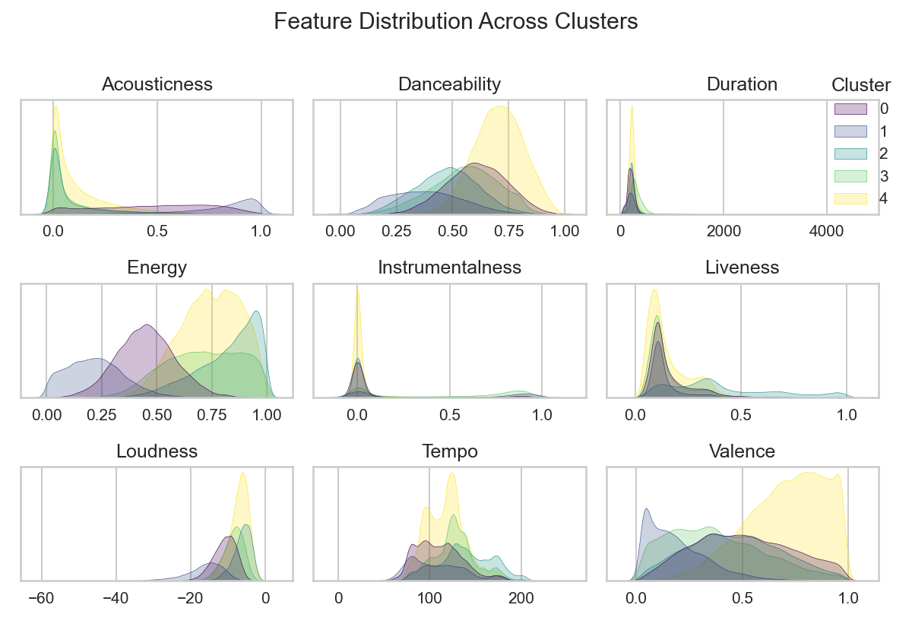

# Spotify songs analysis with lyrics

Database contains almost **300.000** records, It was created by me, in the steps presented in **dataset-creator.jpynb**. Around **~32.000** rows have its own unique **Lyrics** scraped from **genius.com**. However every row contains features like: 

- **Song Name**
- **Release Date**
- **Album Popularity**
- **Artist Popularity**
- **Song Popularity**
- **Artist Genres**
- **Language of Lyrics**
- **Duration**
- **Whether it is a solo song or with someone**
- Other technical features f.ex. **Loudness**, **Danceability**, **Liveness**, ...

One of the main purposes of this analysis is to see how different technical features vary across different **genres**, **languages** and other factors.  
Next thing that would be nice is checking how the **dictionary of words changes with years** in songs across different genres, what are the **most common words** in genres across years, and maybe find some other interesting aspects. 

# Data Cleaning

The data I've created was not exactly clean, I had to perform steps, where some of them were:

- Mapping the genres
- Dealing with missing data
- Simple feature engineering
- Finding the not obvious duplicates

# EDA

Next, I could take a deeper look into the dataset, checking the distributions, unique values and some simple relations between features.  
Some interesting insights were found, after I checked how the songs were changing in terms of technical features across the years. I investigated some of the changes, but **one of them was the most interesting and worrying.**

### Decreasing Valence (sentiment) Across Years
It looks like songs nowadays are getting more and more negative in terms of the sentiment.

I also investigated the average sentiment across the genres, and I found out that the **Raggae** is the most positive genre!

### Where do the songs come out usually?

Another interesting find was about the distribution of songs releases across the weekdays! **Friday seems to be the most popular day**

# Lyrics Analysis

I also wanted really badly to see some trends or changes across the lyrics of different genres, so I investigated:

1. **The most frequent words across genres**

Rap seem to be filled with curse words, other genres on the other hand with love and expressions like "la la", "oh oh", ...

2. **The change in terms of curse words across the years**

The most worrying aspect is the increasing frequency of the curse words in songs over the years.

# Clustering

I decided to perform clusterization on the data in order to find some groups of the songs that may be related in some technical way (The clusterization was based only on Spotify technical features).
As the data was quite memory exhaustive, I decided to go for KMeans algorythm, not only checking for the optimal amount of clusters via **Elbow Method**, but also using the algorythm to separate the groups.

### Elbow Method Results

It showed the most optimal number of clusters, equal 5.

### PCA Dimension Reduction

I reduced the dimensions to 3, keeping ~54% of the explainable variance in order to visualize the data and prevent the dimension curse.

### Clusterization Results

The perspective may be misleading, however the most populated cluster is the yellow (4th) one.

### Clusters Interpretation

That's what I can say about the groups:

- **Cluster No. 0:** Songs in this cluster are **little less energic**, and they are **varied in sentiment and acoustic** - (non-electronic) instruments. **Almost all of them are with lyrics** (no soundtracks) and in majority they are **quite danceable**.  
- **Cluster No. 1:** This group being **the smallest cluster**, is found to have **the majority of electronic beats**, the songs are **the least danceable**, about **half of them are without the words** and they have **the least energy**. They are also **the most negative songs** from all the clusters.  
- **Cluster No. 2:** From the aspects that make this group unique, we can notice **the most energic** songs, around **a half of them are live records**, they also have a **high tempo**.  
- **Cluster No. 3:** This group is **quite energic**, **fully acoustic**, **the longest in duration** on average, **mostly danceable**, however with mostly **negative sentiment**.  
- **Cluster No. 4:** The largest cluster, which have **the most danceable** songs with **lots of energy** and the **most positive sentiment**.

